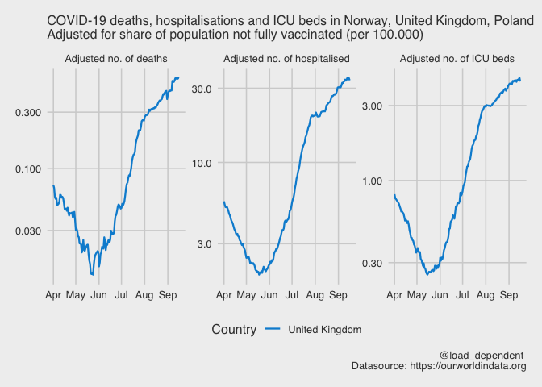
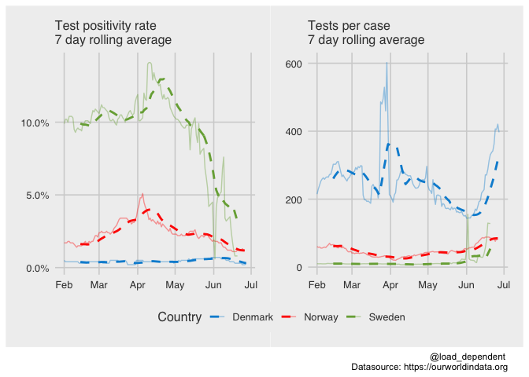

OWID COVID-19 data visualisation
================
Lars Mølgaard Saxhaug <https://twitter.com/load_dependent>

Last compiled on Wednesday 30 June, 2021

#### Countries of interest:

Bulgaria, Denmark, Romania

#### Date range of interest

From Monday 01 March, 2021 to Wednesday 30 June, 2021

#### Adjusted deaths

#### Vaccinations

<!-- -->

#### New cases adjusted for vaccination coverage

<!-- -->

#### Cases, admissions and deaths

<!-- -->

#### Test positivity rate and tests per case in Norway, Denmark, Sweden

<!-- -->
