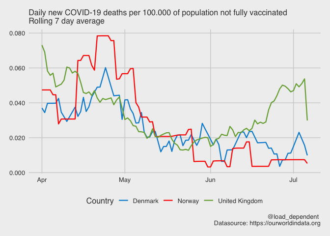
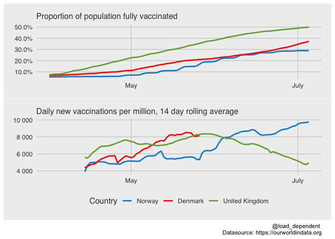
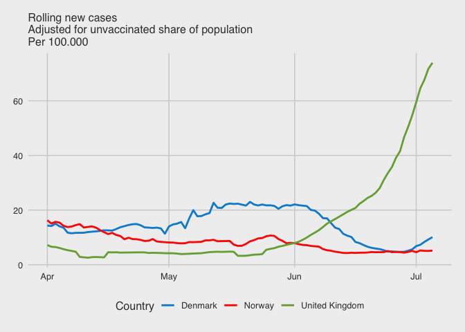
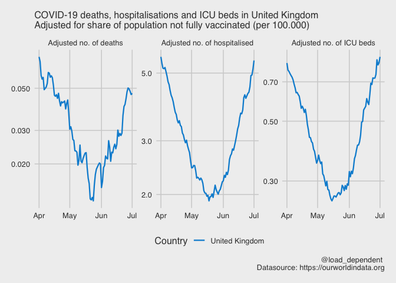
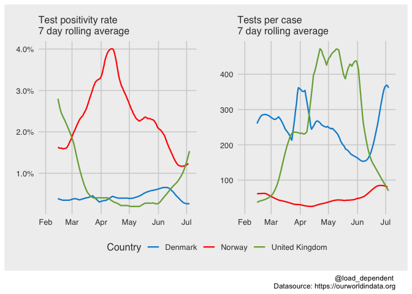

#### Countries of interest:

Norway, Denmark, United Kingdom

#### Date range of interest

From Thursday 01 April, 2021 to Wednesday 07 July, 2021

#### Adjusted deaths

<!-- -->

#### Vaccinations

<!-- -->

#### New cases adjusted for vaccination coverage

<!-- -->

#### Cases, admissions and deaths

<!-- -->

#### Test positivity rate and tests per case in Norway, Denmark, United Kingdom

<!-- -->
