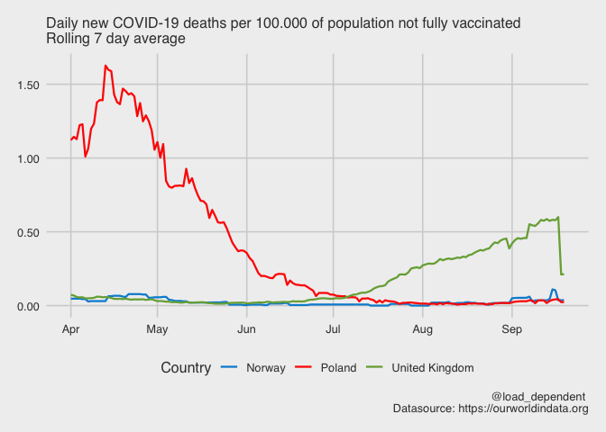
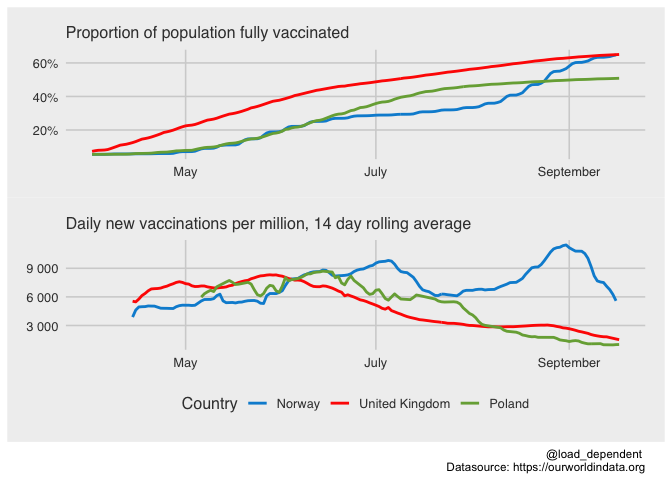
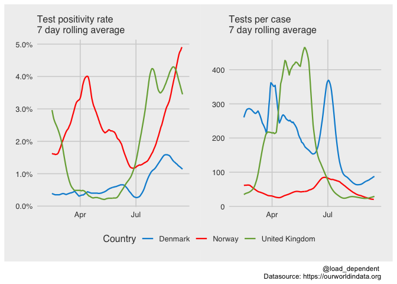

OWID COVID-19 data visualisation
================
Lars Mølgaard Saxhaug <https://twitter.com/load_dependent>

Last compiled on Thursday 29 July, 2021

#### Countries of interest:

France, United States, United Kingdom

#### Date range of interest

From Thursday 01 April, 2021 to Thursday 29 July, 2021

#### Adjusted deaths

<!-- -->

#### Vaccinations

<!-- -->

#### New cases adjusted for vaccination coverage

<!-- -->

#### Cases, admissions and deaths

<!-- -->

#### Test positivity rate and tests per case in Denmark, Norway, United Kingdom

<!-- -->
